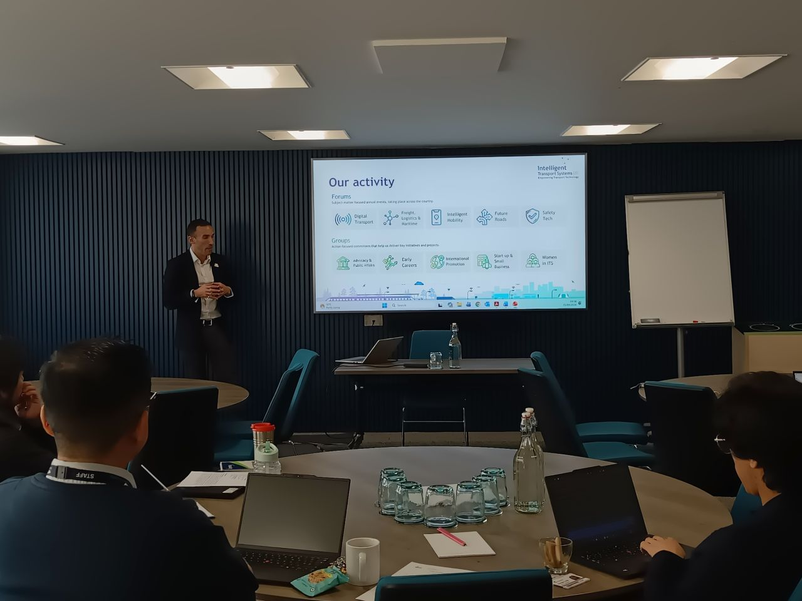

We recently hosted the **first in a series of Aston interactive grant development events**, focused on AI and Robotics, Transportation and Sustainability, with the aim of bringing Aston academics and industry closer together and developing new collaborative ideas.

The _Sustainability and Transport_ theme focused on developing AI-driven solutions to challenging sustainability and transport problems, including sustainable systems modelling, traffic prediction and control, dynamic job scheduling, electric vehicle charging, autonomous baggage handling, water-cleaning robots, and container loading.

The _Autonomous Robots, Perception and Agents_ theme encompasses research in areas including human-robot interaction, manipulation, computer-vision-based perception, virtual agents, and social robot navigation, with a focus on improving the reliability, autonomy, safety, and intuitiveness of physical and non-physical agents.

It was great to welcome [Max Sugarman](https://www.linkedin.com/in/max-sugarman/), Chief Executive of [Intelligent Transport Systems UK](https://www.linkedin.com/company/its-uk-org/), as our keynote speaker, alongside [Shahid Mughal](https://www.linkedin.com/in/shahid-mughal-17891b6/), CEO of [Innvotek](https://www.linkedin.com/company/innvotek/). The day combined invited talks, one-to-one discussions, interactive teamwork, and proposal pitches, giving participants the opportunity to develop ideas and receive feedback from both academic and industry perspectives.

A special thank you to [Aniko Ekart](https://www.linkedin.com/in/aniko-ekart-83b24214/), Director of ACAIRA, for leading and driving this initiative and bringing the event together, and to [Jun Jie Wu](https://www.linkedin.com/in/jun-jie-wu-91858a67/) and [Savas Konur](https://www.linkedin.com/in/savaskonur/) for their support. Many thanks also to [Purbani Chakrabarti](https://www.linkedin.com/in/purbani-chakrabarti-3166873a/) and [Angels Odena](https://www.linkedin.com/in/angels-odena-b761949/) for joining our panel, to everyone who participated and pitched their ideas, and to the organisers [Alireza Rastegarpanah](https://www.linkedin.com/in/alireza-rastegarpanah-37a98441/), [Maria Chli](https://www.linkedin.com/in/maria-chli-478b313/), and [Ulysses Bernardet](https://www.linkedin.com/in/ulyssesbernardet/).

A great first step, and hopefully the beginning of more opportunities for meaningful **academia–industry collaboration at [Aston University](https://www.linkedin.com/school/aston-university/)**.

<figure style="display: flex; flex-direction: column; align-items: center;">
    
    <figcaption style="text-align: center; margin-top: 5px; font-style: italic;">
        Speaker: Max Sugarman. Photo: Alireza Rastegarpanah.
    </figcaption>
</figure>